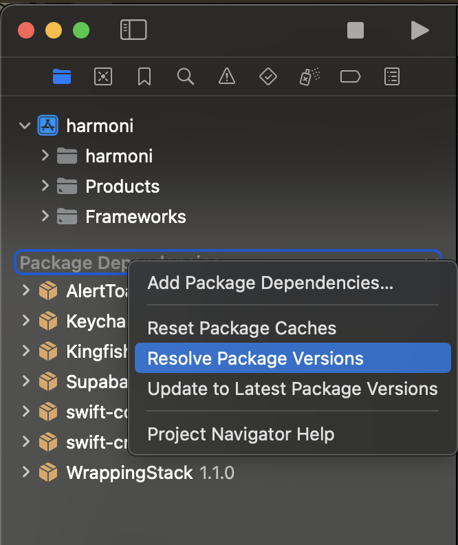
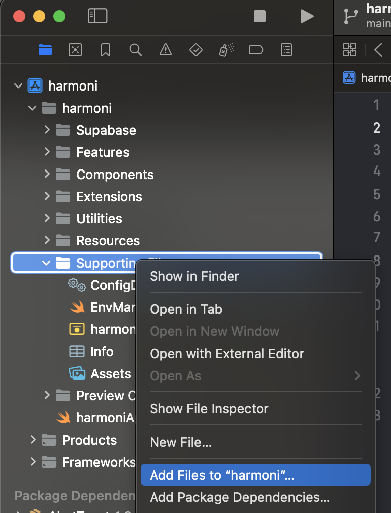
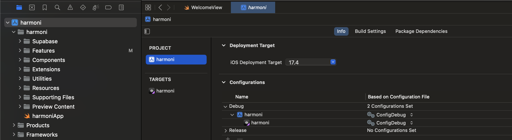

# Harmoni
Artist-driven music streaming rewarding listeners

## Highlights
* Artists get paid immediately on every stream
* Artists control when and how their payouts occur
* Artist may portion a percentage of their payouts back to their listeners
* Listener rewards can be proportional to their streams, or jackpot winner takes all
* A tagging system that allows refined and precise discoverability over generic genre labels

## Install
* Ensure you have the latest macOS and [Xcode](https://developer.apple.com/xcode/) installed
* Open the `harmoni.xcodeproj` file to launch in Xcode
* You may need to resolve package versions by right-clicking on "Package Dependencies"  in the left-hand side of Xcode and choosing "Resolve Package Versions"

  
* Add the `ConfigDebug.xcconfig` file (provided by Kyle) to `harmoni/Supporting Files` by right-clicking on 	"Supporting Files" and choosing ''Add Files to "harmoni"...'

  

* Add `ConfigDebug.xcconfig` as a build configuration by going to harmoni -> Project -> harmoni -> Info -> Configurations -> Debug -> `<select ConfigDebug>`

  

* Try running with `cmd` + `R` (or by tapping the Play button in Xcode)

* Enjoy!